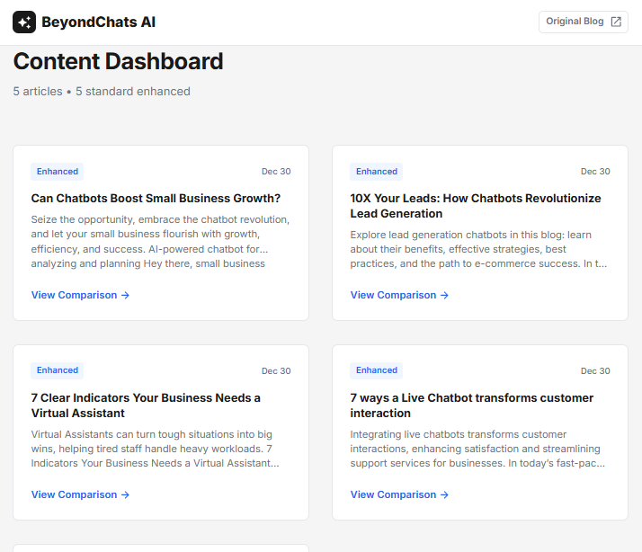
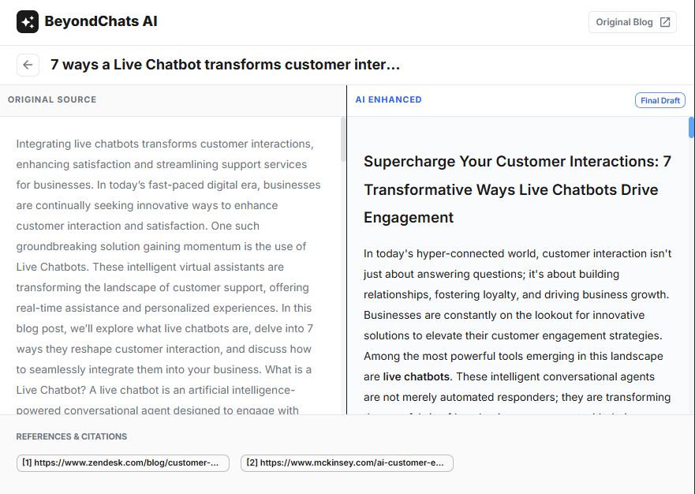

# BeyondChats Article Scraper & AI Enrichment

A full-stack web application that scrapes articles from BeyondChats Blog, enriches them using AI (Google Gemini), and displays results in a professional React UI with side-by-side comparison.

<p align="center">
  
  
</p>

## Architecture
```
┌─────────────────┐     ┌─────────────────┐     ┌─────────────────┐
│  BeyondChats    │────▶│    Scraper      │────▶│    MongoDB      │
│     Blog        │     │   (Puppeteer)   │     │   (Database)    │
└─────────────────┘     └─────────────────┘     └────────┬────────┘
                                                         │
┌─────────────────┐     ┌─────────────────┐              │
│  External       │◀────│   Enrichment    │◀─────────────┘
│  Articles       │     │    Script       │
└────────┬────────┘     └────────┬────────┘
         │                       │
         ▼                       ▼
┌─────────────────┐     ┌─────────────────┐
│  Google Gemini  │────▶│    MongoDB      │
│     (LLM)       │     │  (Updated)      │
└─────────────────┘     └────────┬────────┘
                                 │
                        ┌────────▼────────┐
                        │  Express API    │
                        │  (REST Server)  │
                        └────────┬────────┘
                                 │
                        ┌────────▼────────┐
                        │ React Frontend  │
                        │   (Dashboard)   │
                        └─────────────────┘
```

## What This Does

### Phase 1: Data Seeding
- Web scraping of BeyondChats blog using Puppeteer
- MongoDB storage with Mongoose ODM
- RESTful CRUD API with Express.js

### Phase 2: AI Enrichment
- Google Gemini LLM integration
- Article rewriting with competitor-style formatting
- Reference citation tracking

### Phase 3: Frontend
- Modern React dashboard with dark theme
- Side-by-side article comparison view
- References display section

## Getting Started

### Prerequisites
- Node.js 18 or higher
- MongoDB (local installation or Atlas account)
- Google Gemini API Key

### Installation

Clone the repository and install dependencies for both backend and frontend:
```bash
git clone <your-repo-url>
cd Express
npm install
cd ../my-app
npm install
```

### Configuration

Create a `.env` file in the `Express` directory:
```env
# MongoDB Connection (use your MongoDB Atlas URI or local)
MONGODB_URI=mongodb://localhost:27017/beyondchats

# Google Gemini API Key
GEMINI_API_KEY=your_gemini_api_key_here

# Server Port
PORT=3001
```

### Database Setup

#### MongoDB Atlas (recommended for most users)

Go to [MongoDB Atlas](https://www.mongodb.com/cloud/atlas), create a free cluster, grab your connection string, and update the `MONGODB_URI` in your `.env` file.

#### Local MongoDB

Install [MongoDB Community Edition](https://www.mongodb.com/try/download/community), start the service, and use the default URI: `mongodb://localhost:27017/beyondchats`

### Running the Application

You'll need four terminal windows:
```bash
# Terminal 1: Backend server
cd Express
npm run dev
```
```bash
# Terminal 2: Scraper (run this once to populate your database)
cd Express
npm run scrape
```
```bash
# Terminal 3: AI enrichment
cd Express
npm run enrich
```
```bash
# Terminal 4: Frontend
cd my-app
npm run dev
```

The scraper runs once to pull articles from BeyondChats. The enrichment script processes those articles through Gemini. The frontend displays everything in a comparison view.